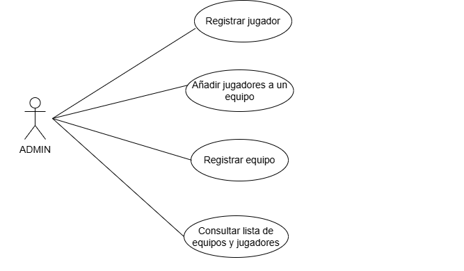
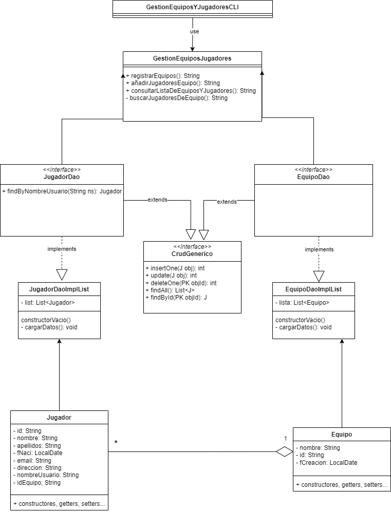

# Sistema de Gestión de Torneos de eSports 
 
## Autor 
Hada Sanchez Serrano 
hadaserrano
 
## Descripción del Proyecto 
Trabajo para la asignatura de entornos en el que he creado una aplicación de gestión de torneos de eSports para lo cual he usado UML y Java. En UML he creado un diagrama de clases y uno de usos.

En cuanto a los actores, solo encontré un actor, el administrador y dos entidades, jugador y equipo.

## Diagramas UML 
### Diagrama de Casos de Uso 

 
### Diagrama de Clases 

 
## Estructura del Proyecto 
 
torneo-esports-uml/ ├── src/ 
│ │ ├── Main.java 
│ │ ├── control/ 
│ │ ├──entidades
│ │ ├──negocio
│ │ ├──test
│ │ ├── vista/ 
├── diagrams/ 
│ ├── DiagramaDeClases.png 
│ ├── DiagramaDeUsos.png 
├── README.md 
├── .gitignore 
 
## Instalación y Ejecución 
1. Clonar el repositorio: 
`git clone https://github.com/hadaserrano/torneo-esports-uml.git` 
 
## Justificación del diseño 
En el diagrama de casos de usos encontramos los siguientes casos: Registrar jugador, Añadir jugadores a un equipo, Registrar equipo, Consultar lista de equipos y jugadores. Decidí incluir el caso de uso de "registrar jugador" ya que no creo que sea posible anadir jugadores a un equipo sin antes haber registrado a los propios jugadores, considero que todos los casos de uso son indepenedientes ya que tu puedes realizar cada uno de ellos de forma individual. El único actor que encontré es el Admin(administrador) el cual es el encargado de realizar cada una de las acciones.

En la implementación en Java lo primero que encontramos es el main, luego las clases Jugador y Equipo se encuentran en el paquete entidades, en el paquete control encontramos la clase GestionEquiposYJugadores, en negocio se encuentran todos los Daos y el CrudGenerico, en el paquete test tenemos el Testing y en el paquete vista tenemos la clase GestionEquiposYJugadoresCli.
 
## Conclusiones  
Este proyecto me ha servido para entender mucho mejor UML y su representación con los diagramas de uso y clases al implementarlo con Java, ya que viendo solo el diagrama no me aclaraba mucho las ideas, ha sido al desarrollarlo en Java que realmente he entendido como representarlo en los diagramas. Además con este proyecto he entendido mucho mejor como organizar el codigo en distintas capas y que función tiene cada parte del proyecto.
